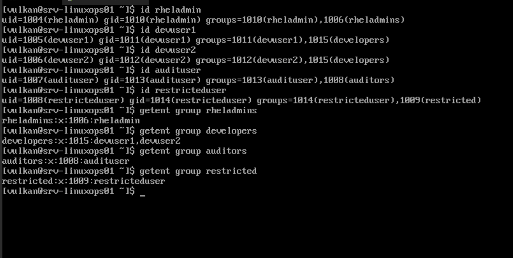
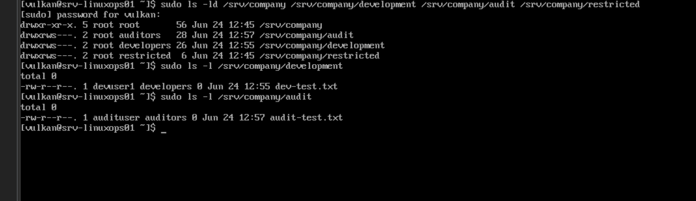
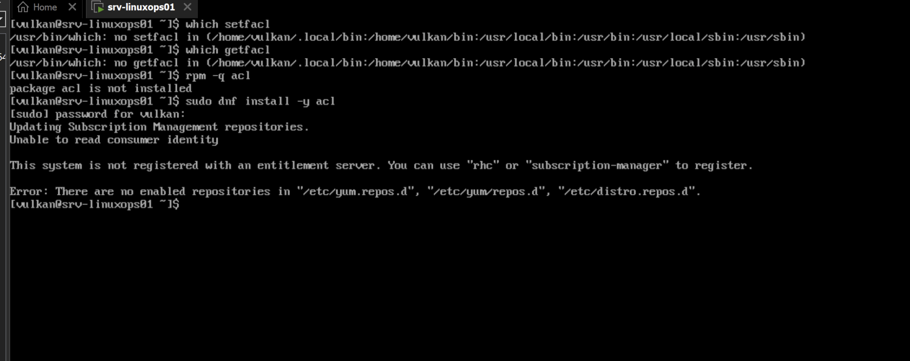
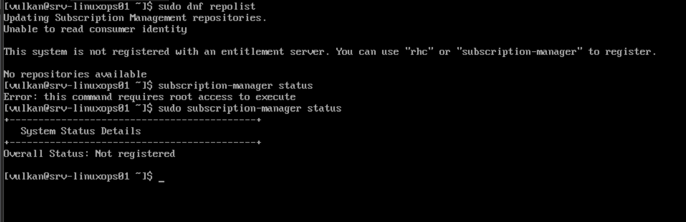
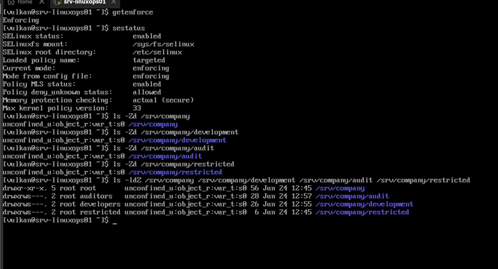
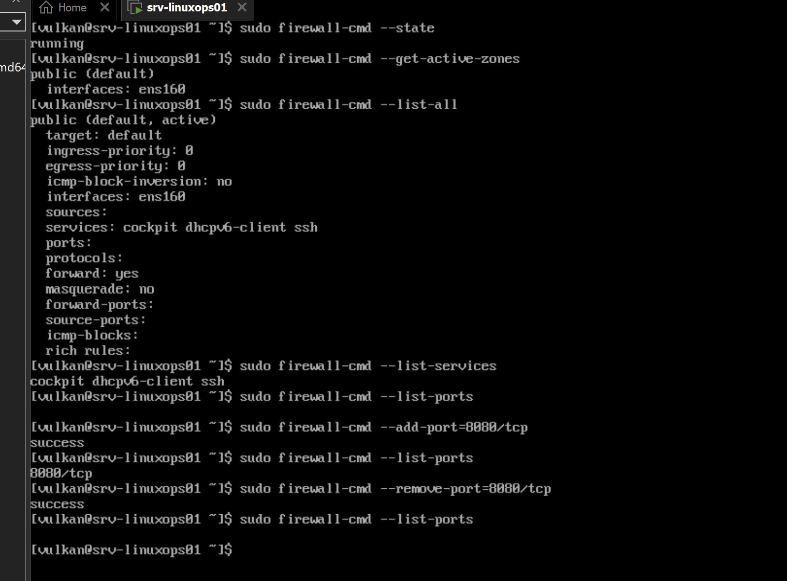

# RHEL Identity and Security Operations Lab — Logbook

## 2026-06-24 — Part 1: Repository setup and planning

### Goal

Start the RHEL Identity and Security Operations Lab by creating the local project structure, initial documentation files and Git repository.

### Work completed

* Created the local project folder.
* Created the main documentation folders:

  * docs
  * screenshots
  * scripts
  * results
* Created README.md.
* Created logbook.md.
* Created .gitkeep files so Git can track empty folders.
* Initialized the local Git repository.
* Prepared the project for the first commit.

### Project structure

```text
RHEL-Identity-Security-Lab/
├── docs/
│   └── .gitkeep
├── results/
│   └── .gitkeep
├── screenshots/
│   └── .gitkeep
├── scripts/
│   └── .gitkeep
├── logbook.md
└── README.md
```

### Commands used

```powershell
mkdir RHEL-Identity-Security-Lab
cd RHEL-Identity-Security-Lab
mkdir docs
mkdir screenshots
mkdir scripts
mkdir results
New-Item README.md
New-Item logbook.md
git init
New-Item docs\.gitkeep
New-Item results\.gitkeep
New-Item screenshots\.gitkeep
New-Item scripts\.gitkeep
git status
```

### Command purpose

| Command                          | Purpose                                                |
| -------------------------------- | ------------------------------------------------------ |
| mkdir RHEL-Identity-Security-Lab | Creates the main project folder.                       |
| cd RHEL-Identity-Security-Lab    | Moves into the project folder.                         |
| mkdir docs                       | Creates the documentation folder.                      |
| mkdir screenshots                | Creates the screenshot evidence folder.                |
| mkdir scripts                    | Creates the script storage folder.                     |
| mkdir results                    | Creates the command output and result storage folder.  |
| New-Item README.md               | Creates the main project README file.                  |
| New-Item logbook.md              | Creates the project logbook file.                      |
| git init                         | Initializes a local Git repository.                    |
| New-Item .gitkeep                | Creates placeholder files so Git tracks empty folders. |
| git status                       | Shows untracked files and repository status.           |

### Notes

PowerShell does not handle `mkdir docs screenshots scripts results` the same way as Linux Bash. The folders were created one at a time instead.

Git does not track empty folders by default, so `.gitkeep` files were added to docs, results, screenshots and scripts.

This part prepares the project structure and documentation base for the rest of the lab.

### Evidence

Screenshot:


---

## 2026-06-24 — Part 2: RHEL server baseline verification

### Goal

Verify the current Red Hat Enterprise Linux server baseline before configuring users, sudo policy, permissions, ACLs, SELinux settings or firewall rules.

### Work completed

* Connected to the RHEL server through SSH.
* Verified the server hostname.
* Verified the currently logged-in user.
* Verified the installed operating system and version.
* Verified the kernel and virtualization platform.
* Reviewed the active network interface and IP address.
* Reviewed disk usage.
* Reviewed memory and swap usage.
* Verified SELinux mode.
* Verified firewalld service status.
* Saved baseline verification screenshots.

### Verification results

| Item                  | Result                             |
| --------------------- | ---------------------------------- |
| Hostname              | srv-linuxops01                     |
| Logged-in user        | vulkan                             |
| Operating system      | Red Hat Enterprise Linux 10.1      |
| Version name          | Coughlan                           |
| Kernel                | Linux 6.12.0-124.8.1.el10_1.x86_64 |
| Virtualization        | VMware                             |
| Network interface     | ens160                             |
| IP address            | 192.168.80.134/24                  |
| Root filesystem       | /dev/mapper/rhel-root              |
| Root filesystem size  | 37 GB                              |
| Root filesystem usage | 6%                                 |
| Memory                | 1.6 GiB                            |
| Swap                  | 2.0 GiB                            |
| SELinux mode          | Enforcing                          |
| Firewall service      | firewalld                          |
| Firewall status       | active running                     |
| Firewall boot state   | enabled                            |

### Commands used

```bash
hostnamectl
whoami
cat /etc/os-release
ip addr
df
df -h
free -h
getenforce
sudo systemctl status firewalld --no-pager
```

### Command purpose

| Command                                    | Purpose                                                                                |
| ------------------------------------------ | -------------------------------------------------------------------------------------- |
| hostnamectl                                | Shows hostname, operating system, kernel, architecture and virtualization information. |
| whoami                                     | Shows the currently logged-in user.                                                    |
| cat /etc/os-release                        | Displays the installed Linux distribution and version details.                         |
| ip addr                                    | Shows network interfaces, MAC addresses and IP addresses.                              |
| df                                         | Shows filesystem disk usage in block format.                                           |
| df -h                                      | Shows filesystem disk usage in human-readable format.                                  |
| free -h                                    | Shows memory and swap usage in human-readable format.                                  |
| getenforce                                 | Shows the current SELinux mode.                                                        |
| sudo systemctl status firewalld --no-pager | Shows whether the firewalld service is loaded, enabled and running.                    |

### Notes

The server baseline was verified before making identity, permission or security configuration changes.

The server is running Red Hat Enterprise Linux 10.1 on VMware with the hostname srv-linuxops01. The active network interface is ens160, and the server IP address is 192.168.80.134/24.

SELinux is running in Enforcing mode, which is important for this lab because later parts will include SELinux review and context checks.

Firewalld is active and enabled, which confirms that the system firewall is running before any future firewall review or rule testing.

The `df` command was run once before `df -h`. The `df -h` output is easier to read, but both commands show filesystem usage.

This part provides a clean baseline for the rest of the RHEL Identity and Security Operations Lab.

### Evidence

Screenshots:


---

## 2026-06-24 — Part 3: Users and groups

### Goal

Create role-based Linux users and groups for the RHEL Identity and Security Operations Lab.

This part documents basic identity management by creating separate users and groups for administration, development, auditing and restricted access.

### Work completed

* Created the role-based groups:

  * rheladmins
  * developers
  * auditors
  * restricted

* Created the lab users:

  * rheladmin
  * devuser1
  * devuser2
  * audituser
  * restricteduser

* Added each user to the correct role-based group.

* Verified user and group membership with `id`.

* Verified group database entries with `getent group`.

* Saved screenshot evidence of the final verification output.

### Verification results

| Item                      | Result                     |
| ------------------------- | -------------------------- |
| Admin group               | rheladmins                 |
| Developer group           | developers                 |
| Audit group               | auditors                   |
| Restricted group          | restricted                 |
| Admin user                | rheladmin                  |
| Developer users           | devuser1, devuser2         |
| Audit user                | audituser                  |
| Restricted user           | restricteduser             |
| rheladmin membership      | rheladmin, rheladmins      |
| devuser1 membership       | devuser1, developers       |
| devuser2 membership       | devuser2, developers       |
| audituser membership      | audituser, auditors        |
| restricteduser membership | restricteduser, restricted |

### Commands used

```bash
sudo groupadd rheladmins
sudo groupadd developers
sudo groupadd auditors
sudo groupadd restricted

sudo useradd -m -s /bin/bash rheladmin
sudo useradd -m -s /bin/bash devuser1
sudo useradd -m -s /bin/bash devuser2
sudo useradd -m -s /bin/bash audituser
sudo useradd -m -s /bin/bash restricteduser

sudo passwd rheladmin
sudo passwd devuser1
sudo passwd devuser2
sudo passwd audituser
sudo passwd restricteduser

sudo usermod -aG rheladmins rheladmin
sudo usermod -aG developers devuser1
sudo usermod -aG developers devuser2
sudo usermod -aG auditors audituser
sudo usermod -aG restricted restricteduser

id rheladmin
id devuser1
id devuser2
id audituser
id restricteduser

getent group rheladmins
getent group developers
getent group auditors
getent group restricted
```

### Command purpose

| Command                   | Purpose                                                                          |
| ------------------------- | -------------------------------------------------------------------------------- |
| `groupadd`                | Creates a new Linux group.                                                       |
| `useradd -m -s /bin/bash` | Creates a new user, creates a home directory and sets Bash as the login shell.   |
| `passwd`                  | Sets or changes a user password.                                                 |
| `usermod -aG`             | Adds an existing user to an additional group without removing other memberships. |
| `id`                      | Shows a user's UID, primary group and additional group memberships.              |
| `getent group`            | Checks group information from the system group database.                         |

### Notes

The `rheladmins` group was verified and already contained the `rheladmin` user.

The `restricted` group existed but did not yet contain `restricteduser` when first checked.

The `developers` and `auditors` groups had to be created before users could be added to them. After creating the missing groups, all users were added to the correct role-based groups.

The group ID numbers may differ between systems. The important result is that each user appears in the correct group.

This part creates the identity foundation for later lab parts, including sudo policy, shared directory permissions, ACL permissions and audit review.

### Evidence

Screenshot:



## 2026-06-24 — Part 4: Sudo policy

### Goal

Configure and verify controlled sudo access for the RHEL Identity and Security Operations Lab.

This part documents basic privilege management by allowing the admin test user to use sudo while confirming that the restricted test user does not have administrator access.

### Work completed

* Added `rheladmin` to the `wheel` group.
* Verified that `rheladmin` is a member of both `rheladmins` and `wheel`.
* Verified the current members of the `wheel` group.
* Switched to the `rheladmin` account.
* Confirmed that `rheladmin` can run commands with sudo privileges.
* Switched to the `restricteduser` account.
* Confirmed that `restricteduser` cannot run commands with sudo privileges.
* Saved screenshot evidence of the sudo policy verification.

### Verification results

| Item                           | Result                          |
| ------------------------------ | ------------------------------- |
| Admin test user                | rheladmin                       |
| Admin role group               | rheladmins                      |
| Sudo access group              | wheel                           |
| rheladmin sudo access          | Confirmed                       |
| rheladmin `sudo whoami` result | root                            |
| Restricted test user           | restricteduser                  |
| restricteduser sudo access     | Denied                          |
| restricteduser sudo result     | User is not in the sudoers file |

### Commands used

```bash
sudo usermod -aG wheel rheladmin

id rheladmin
getent group wheel

su - rheladmin
whoami
sudo whoami
exit

su - restricteduser
whoami
sudo whoami
exit
```

### Command purpose

| Command                            | Purpose                                                                               |
| ---------------------------------- | ------------------------------------------------------------------------------------- |
| `sudo usermod -aG wheel rheladmin` | Adds `rheladmin` to the `wheel` group without removing existing group memberships.    |
| `id rheladmin`                     | Verifies the user ID, primary group and additional group memberships for `rheladmin`. |
| `getent group wheel`               | Shows the current members of the `wheel` group.                                       |
| `su - rheladmin`                   | Switches to the `rheladmin` account and loads that user’s login environment.          |
| `whoami`                           | Shows the currently active user account.                                              |
| `sudo whoami`                      | Tests whether the current user can run a command with root privileges.                |
| `exit`                             | Logs out from the switched user session and returns to the previous user.             |
| `su - restricteduser`              | Switches to the restricted test account.                                              |

### Notes

On RHEL systems, the `wheel` group is commonly used to grant sudo privileges.

The `rheladmin` account successfully ran `sudo whoami`, and the command returned `root`. This confirms that the admin test account has working sudo access.

The `restricteduser` account attempted to run `sudo whoami`, but the system denied access and reported that the user is not in the sudoers file. This confirms that the restricted account does not have administrator privileges.

The “Last login” message appeared when switching users. This is normal and does not affect the test result.

This part creates the sudo access foundation for later security testing and permission reviews.

### Evidence

Screenshot:


---

## 2026-06-24 — Part 5: Shared directory permissions

### Goal

Create shared Linux directories with role-based group ownership and permissions.

This part documents how shared folders can be controlled using Linux ownership, group permissions and the setgid permission bit.

### Work completed

* Created the main shared directory structure under `/srv/company`.
* Created shared directories for:

  * development
  * audit
  * restricted

* Set group ownership for each shared directory.
* Applied restricted permissions with `chmod 2770`.
* Verified that the setgid bit was active on the shared directories.
* Tested that `devuser1` could create a file inside the development directory.
* Confirmed that the development test file inherited the `developers` group.
* Confirmed that `devuser1` could not access the audit directory.
* Tested that `audituser` could create a file inside the audit directory.
* Confirmed that the audit test file inherited the `auditors` group.
* Confirmed that `audituser` could not access the development directory.
* Used `sudo ls` for final verification of directory permissions and test files.
* Saved screenshot evidence of the shared directory permissions and test files.

### Directory plan

| Directory | Owner | Group | Purpose |
|---|---|---|---|
| `/srv/company` | root | root | Main shared company directory |
| `/srv/company/development` | root | developers | Shared directory for developer users |
| `/srv/company/audit` | root | auditors | Shared directory for audit users |
| `/srv/company/restricted` | root | restricted | Shared directory for restricted users |

### Verification results

| Item | Result |
|---|---|
| Development directory group | developers |
| Audit directory group | auditors |
| Restricted directory group | restricted |
| Development directory permissions | drwxrws--- |
| Audit directory permissions | drwxrws--- |
| Restricted directory permissions | drwxrws--- |
| Setgid on shared directories | Confirmed |
| Developer test user | devuser1 |
| Developer test file | `/srv/company/development/dev-test.txt` |
| Developer test file ownership | devuser1 developers |
| devuser1 access to development | Confirmed |
| devuser1 access to audit | Denied |
| Audit test user | audituser |
| Audit test file | `/srv/company/audit/audit-test.txt` |
| Audit test file ownership | audituser auditors |
| audituser access to audit | Confirmed |
| audituser access to development | Denied |

### Commands used

```bash
sudo mkdir -p /srv/company/development
sudo mkdir -p /srv/company/audit
sudo mkdir -p /srv/company/restricted

sudo chown root:developers /srv/company/development
sudo chown root:auditors /srv/company/audit
sudo chown root:restricted /srv/company/restricted

sudo chmod 2770 /srv/company/development
sudo chmod 2770 /srv/company/audit
sudo chmod 2770 /srv/company/restricted

ls -ld /srv/company
ls -ld /srv/company/development
ls -ld /srv/company/audit
ls -ld /srv/company/restricted

su - devuser1
touch /srv/company/development/dev-test.txt
ls -l /srv/company/development/dev-test.txt
ls /srv/company/audit
exit

su - audituser
touch /srv/company/audit/audit-test.txt
ls -l /srv/company/audit/audit-test.txt
ls /srv/company/development
exit

sudo ls -ld /srv/company /srv/company/development /srv/company/audit /srv/company/restricted
sudo ls -l /srv/company/development
sudo ls -l /srv/company/audit
```

### Command purpose

| Command | Purpose |
|---|---|
| `sudo mkdir -p` | Creates directories, including parent directories if needed. |
| `sudo chown root:group` | Sets the owner to `root` and assigns the directory to the correct role-based group. |
| `sudo chmod 2770` | Gives full access to owner and group, blocks others and enables setgid inheritance. |
| `ls -ld` | Shows permissions, owner and group for the directory itself. |
| `su - devuser1` | Switches to the developer test user. |
| `touch` | Creates an empty test file. |
| `ls -l` | Shows file ownership, group ownership and permissions. |
| `ls /srv/company/audit` | Tests whether `devuser1` can access the audit directory. |
| `su - audituser` | Switches to the audit test user. |
| `ls /srv/company/development` | Tests whether `audituser` can access the development directory. |
| `exit` | Leaves the switched user session and returns to the previous user. |
| `sudo ls` | Lists protected directory contents with administrator privileges for final verification. |

### Notes

The shared directories were created under `/srv/company` to represent company-style role-based storage.

The development, audit and restricted directories were owned by `root` and assigned to their matching role-based groups.

The permission mode `2770` was used. The first digit, `2`, enables the setgid bit on the directory. This makes new files created inside the directory inherit the directory group.

The permissions appeared as `drwxrws---`, where the `s` confirms that setgid is active.

The `devuser1` account successfully created `dev-test.txt` in the development directory, and the file inherited the `developers` group.

The `audituser` account successfully created `audit-test.txt` in the audit directory, and the file inherited the `auditors` group.

Access tests confirmed that `devuser1` could not list the audit directory and that `audituser` could not list the development directory.

When logged in as `vulkan`, direct listing of the development and audit directory contents returned permission denied because `vulkan` is not a member of those role-based groups. `sudo ls` was used for final verification.

This part demonstrates basic least-privilege access control using Linux groups, ownership, directory permissions and setgid inheritance.

### Evidence

Screenshot:



---

## 2026-06-24 — Part 6: ACL tooling and repository limitation

### Goal

Check whether ACL permissions can be configured on the RHEL server and verify whether the required ACL tools are available.

This part was planned to use ACLs to give `audituser` limited read access to the development directory without adding the user to the `developers` group.

### Work completed

* Checked whether the ACL management tools `setfacl` and `getfacl` were available.
* Verified that neither ACL tool was installed.
* Checked whether the `acl` package was installed.
* Attempted to install the `acl` package with `dnf`.
* Confirmed that package installation could not continue because the system is not registered and has no enabled repositories.
* Checked repository availability with `dnf repolist`.
* Checked Red Hat subscription status with `subscription-manager status`.
* Re-ran `subscription-manager status` with `sudo` after the non-root command reported that root access was required.
* Documented the ACL tooling and repository limitation.

### Verification results

| Item | Result |
|---|---|
| `setfacl` availability | Not installed |
| `getfacl` availability | Not installed |
| `acl` package status | Not installed |
| Package installation attempt | Failed |
| Repository status | No repositories available |
| Subscription status | Not registered |
| ACL configuration | Not completed due to missing tools and unavailable repositories |

### Commands used

```bash
which setfacl
which getfacl
rpm -q acl
sudo dnf install -y acl
sudo dnf repolist
subscription-manager status
sudo subscription-manager status
```

### Command purpose

| Command | Purpose |
|---|---|
| `which setfacl` | Checks whether the `setfacl` command is available in the system path. |
| `which getfacl` | Checks whether the `getfacl` command is available in the system path. |
| `rpm -q acl` | Checks whether the `acl` package is installed. |
| `sudo dnf install -y acl` | Attempts to install the ACL tools package. |
| `sudo dnf repolist` | Lists enabled software repositories for package installation. |
| `subscription-manager status` | Checks Red Hat subscription status as the current user. |
| `sudo subscription-manager status` | Checks Red Hat subscription status with administrator privileges. |

### Notes

The ACL tools `setfacl` and `getfacl` were not installed on the system.

The `acl` package was also not installed. An installation attempt using `dnf` failed because the system is not registered with a Red Hat entitlement server and no repositories are enabled.

The repository check confirmed that no repositories were available. The subscription status check confirmed that the system is not registered.

Because the required ACL tools could not be installed, ACL permission configuration was not completed in this lab environment.

This is a realistic system administration limitation. Future remediation would require registering the RHEL system with Red Hat subscription management or enabling a valid repository source before installing the missing ACL tools.

This part demonstrates troubleshooting of missing Linux administration tools, package availability, repository configuration and subscription state.

### Evidence

Screenshots:





---

## 2026-06-24 — Part 7: SELinux basics

### Goal

Review the current SELinux status and inspect SELinux security contexts on the shared directory structure.

This part documents SELinux enforcement status and shows how SELinux labels exist alongside normal Linux permissions.

### Work completed

* Checked the current SELinux mode with `getenforce`.
* Reviewed detailed SELinux status with `sestatus`.
* Verified that SELinux is enabled.
* Verified that SELinux is running in enforcing mode.
* Verified that the loaded SELinux policy is `targeted`.
* Checked SELinux contexts on `/srv/company`.
* Checked SELinux contexts on the shared company subdirectories.
* Reviewed normal permissions and SELinux contexts together with `ls -ldZ`.
* Saved screenshot evidence of the SELinux status and context review.

### Verification results

| Item | Result |
|---|---|
| SELinux status | enabled |
| Current SELinux mode | enforcing |
| Mode from config file | enforcing |
| Loaded policy name | targeted |
| Policy MLS status | enabled |
| Max kernel policy version | 33 |
| `/srv/company` context | `unconfined_u:object_r:var_t:s0` |
| `/srv/company/development` context | `unconfined_u:object_r:var_t:s0` |
| `/srv/company/audit` context | `unconfined_u:object_r:var_t:s0` |
| `/srv/company/restricted` context | `unconfined_u:object_r:var_t:s0` |
| `/srv/company/development` permissions | `drwxrws--- root developers` |
| `/srv/company/audit` permissions | `drwxrws--- root auditors` |
| `/srv/company/restricted` permissions | `drwxrws--- root restricted` |

### Commands used

```bash
getenforce
sestatus

ls -Zd /srv/company
ls -Zd /srv/company/development
ls -Zd /srv/company/audit
ls -Zd /srv/company/restricted

ls -ldZ /srv/company /srv/company/development /srv/company/audit /srv/company/restricted
```

### Command purpose

| Command | Purpose |
|---|---|
| `getenforce` | Shows the current SELinux mode. |
| `sestatus` | Shows detailed SELinux status, policy and configuration information. |
| `ls -Zd` | Shows the SELinux context for a directory. |
| `ls -ldZ` | Shows normal Linux permissions, ownership and SELinux context together. |

### Notes

SELinux is enabled and running in enforcing mode.

The loaded SELinux policy is `targeted`, which is the common policy type used on RHEL systems.

The shared directories under `/srv/company` currently use the SELinux context `unconfined_u:object_r:var_t:s0`.

Normal Linux permissions and SELinux labels are separate security layers. The earlier permission work controls user and group access, while SELinux contexts provide an additional policy-based access control layer.

The shared directories still show the expected Linux permissions and group ownership:

* `/srv/company/development` is assigned to the `developers` group.
* `/srv/company/audit` is assigned to the `auditors` group.
* `/srv/company/restricted` is assigned to the `restricted` group.
* The setgid bit is still visible through the `drwxrws---` permission pattern.

No SELinux policy changes were made in this part. This part was a review and documentation step only.

### Evidence

Screenshot:



---

## 2026-06-24 — Part 8: Firewalld review

### Goal

Review the current RHEL firewall configuration with firewalld and verify that temporary port changes can be added and removed safely.

This part documents the active firewall state, active zone, allowed services, open ports and a temporary test using TCP port 8080.

### Work completed

* Checked that firewalld is running.
* Verified the active firewalld zone.
* Verified that the active network interface is assigned to the public zone.
* Reviewed the full active zone configuration with `firewall-cmd --list-all`.
* Listed currently allowed firewalld services.
* Checked for manually opened custom ports.
* Temporarily opened TCP port 8080.
* Verified that TCP port 8080 appeared in the open port list.
* Removed TCP port 8080 again.
* Verified that the custom port list was blank after removal.
* Saved screenshot evidence of the firewalld review and temporary port test.

### Verification results

| Item | Result |
|---|---|
| Firewall service | firewalld |
| Firewall state | running |
| Active zone | public |
| Default zone shown | public |
| Active interface | ens160 |
| Allowed services | cockpit, dhcpv6-client, ssh |
| Custom ports before test | None |
| Temporary test port | 8080/tcp |
| Port add result | success |
| Port remove result | success |
| Custom ports after test | None |
| Permanent firewall changes made | No |

### Commands used

```bash
sudo firewall-cmd --state
sudo firewall-cmd --get-active-zones
sudo firewall-cmd --list-all
sudo firewall-cmd --list-services
sudo firewall-cmd --list-ports

sudo firewall-cmd --add-port=8080/tcp
sudo firewall-cmd --list-ports
sudo firewall-cmd --remove-port=8080/tcp
sudo firewall-cmd --list-ports
```

### Command purpose

| Command | Purpose |
|---|---|
| `sudo firewall-cmd --state` | Checks whether firewalld is running. |
| `sudo firewall-cmd --get-active-zones` | Shows active firewall zones and the network interfaces assigned to them. |
| `sudo firewall-cmd --list-all` | Shows the full configuration of the active/default firewalld zone. |
| `sudo firewall-cmd --list-services` | Lists firewalld services allowed in the current zone. |
| `sudo firewall-cmd --list-ports` | Lists manually opened custom ports in the current zone. |
| `sudo firewall-cmd --add-port=8080/tcp` | Temporarily opens TCP port 8080 in the active zone. |
| `sudo firewall-cmd --remove-port=8080/tcp` | Removes the temporary TCP port 8080 opening. |

### Notes

Firewalld was running during the review.

The active zone was `public`, and the active interface was `ens160`.

The allowed services were `cockpit`, `dhcpv6-client` and `ssh`.

No custom ports were open before the temporary test.

TCP port 8080 was temporarily opened and verified with `firewall-cmd --list-ports`. The port was then removed, and the final port list returned blank again.

No permanent firewall rule changes were made because the commands did not use the `--permanent` option.

This part demonstrates basic firewall review, service inspection, temporary port testing and safe cleanup of temporary firewall changes.

### Evidence

Screenshot:



