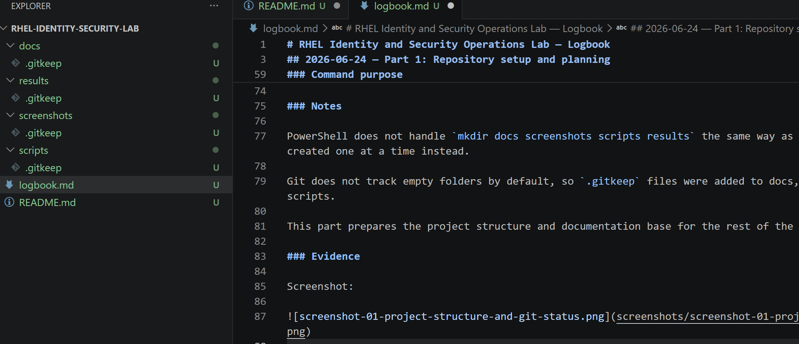
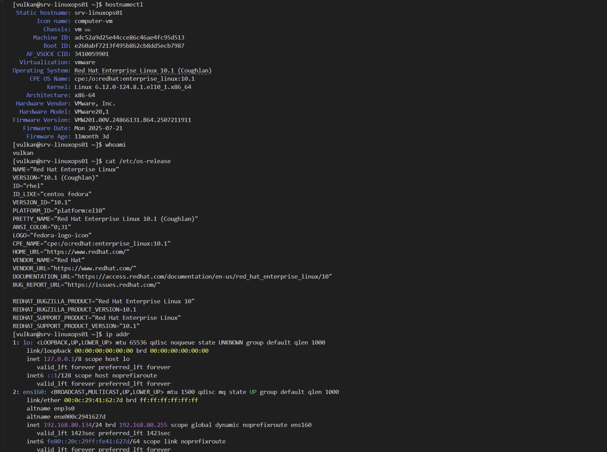
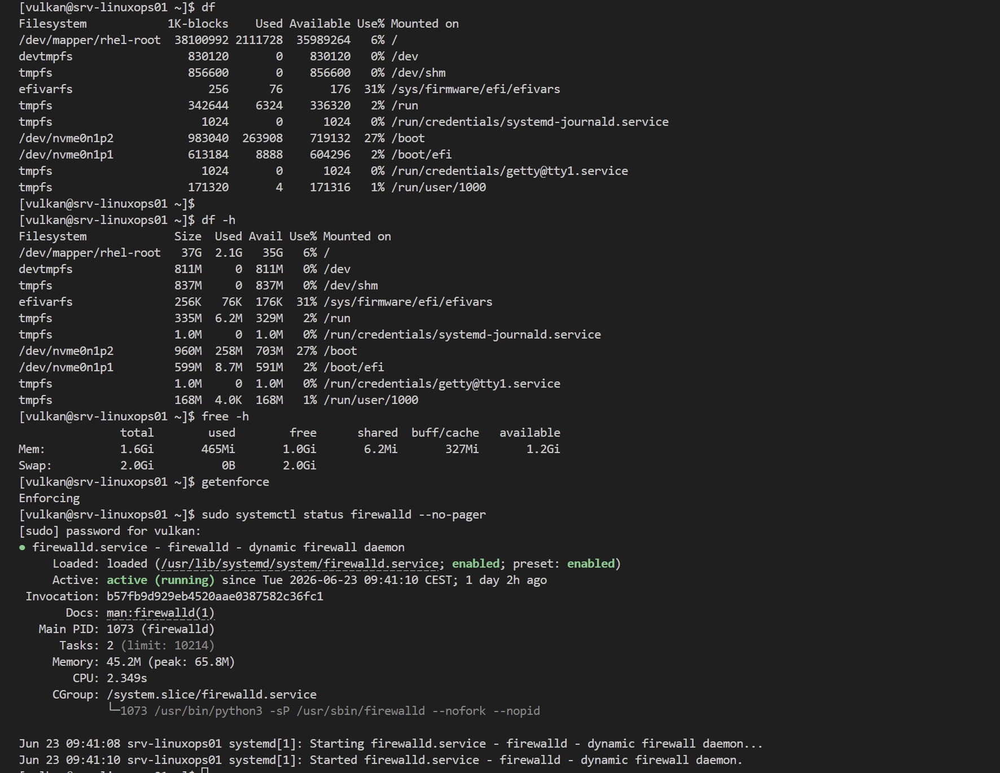

# RHEL Identity and Security Operations Lab — Logbook

## 2026-06-24 — Part 1: Repository setup and planning

### Goal

Start the RHEL Identity and Security Operations Lab by creating the local project structure, initial documentation files and Git repository.

### Work completed

* Created the local project folder.
* Created the main documentation folders:

  * docs
  * screenshots
  * scripts
  * results
* Created README.md.
* Created logbook.md.
* Created .gitkeep files so Git can track empty folders.
* Initialized the local Git repository.
* Prepared the project for the first commit.

### Project structure

```text
RHEL-Identity-Security-Lab/
├── docs/
│   └── .gitkeep
├── results/
│   └── .gitkeep
├── screenshots/
│   └── .gitkeep
├── scripts/
│   └── .gitkeep
├── logbook.md
└── README.md
```

### Commands used

```powershell
mkdir RHEL-Identity-Security-Lab
cd RHEL-Identity-Security-Lab
mkdir docs
mkdir screenshots
mkdir scripts
mkdir results
New-Item README.md
New-Item logbook.md
git init
New-Item docs\.gitkeep
New-Item results\.gitkeep
New-Item screenshots\.gitkeep
New-Item scripts\.gitkeep
git status
```

### Command purpose

| Command                          | Purpose                                                |
| -------------------------------- | ------------------------------------------------------ |
| mkdir RHEL-Identity-Security-Lab | Creates the main project folder.                       |
| cd RHEL-Identity-Security-Lab    | Moves into the project folder.                         |
| mkdir docs                       | Creates the documentation folder.                      |
| mkdir screenshots                | Creates the screenshot evidence folder.                |
| mkdir scripts                    | Creates the script storage folder.                     |
| mkdir results                    | Creates the command output and result storage folder.  |
| New-Item README.md               | Creates the main project README file.                  |
| New-Item logbook.md              | Creates the project logbook file.                      |
| git init                         | Initializes a local Git repository.                    |
| New-Item .gitkeep                | Creates placeholder files so Git tracks empty folders. |
| git status                       | Shows untracked files and repository status.           |

### Notes

PowerShell does not handle `mkdir docs screenshots scripts results` the same way as Linux Bash. The folders were created one at a time instead.

Git does not track empty folders by default, so `.gitkeep` files were added to docs, results, screenshots and scripts.

This part prepares the project structure and documentation base for the rest of the lab.

### Evidence

Screenshot:



---

## 2026-06-24 — Part 2: RHEL server baseline verification

### Goal

Verify the current Red Hat Enterprise Linux server baseline before configuring users, sudo policy, permissions, ACLs, SELinux settings or firewall rules.

### Work completed

* Connected to the RHEL server through SSH.
* Verified the server hostname.
* Verified the currently logged-in user.
* Verified the installed operating system and version.
* Verified the kernel and virtualization platform.
* Reviewed the active network interface and IP address.
* Reviewed disk usage.
* Reviewed memory and swap usage.
* Verified SELinux mode.
* Verified firewalld service status.
* Saved baseline verification screenshots.

### Verification results

| Item                  | Result                             |
| --------------------- | ---------------------------------- |
| Hostname              | srv-linuxops01                     |
| Logged-in user        | vulkan                             |
| Operating system      | Red Hat Enterprise Linux 10.1      |
| Version name          | Coughlan                           |
| Kernel                | Linux 6.12.0-124.8.1.el10_1.x86_64 |
| Virtualization        | VMware                             |
| Network interface     | ens160                             |
| IP address            | 192.168.80.134/24                  |
| Root filesystem       | /dev/mapper/rhel-root              |
| Root filesystem size  | 37 GB                              |
| Root filesystem usage | 6%                                 |
| Memory                | 1.6 GiB                            |
| Swap                  | 2.0 GiB                            |
| SELinux mode          | Enforcing                          |
| Firewall service      | firewalld                          |
| Firewall status       | active running                     |
| Firewall boot state   | enabled                            |

### Commands used

```bash
hostnamectl
whoami
cat /etc/os-release
ip addr
df
df -h
free -h
getenforce
sudo systemctl status firewalld --no-pager
```

### Command purpose

| Command                                    | Purpose                                                                                |
| ------------------------------------------ | -------------------------------------------------------------------------------------- |
| hostnamectl                                | Shows hostname, operating system, kernel, architecture and virtualization information. |
| whoami                                     | Shows the currently logged-in user.                                                    |
| cat /etc/os-release                        | Displays the installed Linux distribution and version details.                         |
| ip addr                                    | Shows network interfaces, MAC addresses and IP addresses.                              |
| df                                         | Shows filesystem disk usage in block format.                                           |
| df -h                                      | Shows filesystem disk usage in human-readable format.                                  |
| free -h                                    | Shows memory and swap usage in human-readable format.                                  |
| getenforce                                 | Shows the current SELinux mode.                                                        |
| sudo systemctl status firewalld --no-pager | Shows whether the firewalld service is loaded, enabled and running.                    |

### Notes

The server baseline was verified before making identity, permission or security configuration changes.

The server is running Red Hat Enterprise Linux 10.1 on VMware with the hostname srv-linuxops01. The active network interface is ens160, and the server IP address is 192.168.80.134/24.

SELinux is running in Enforcing mode, which is important for this lab because later parts will include SELinux review and context checks.

Firewalld is active and enabled, which confirms that the system firewall is running before any future firewall review or rule testing.

The `df` command was run once before `df -h`. The `df -h` output is easier to read, but both commands show filesystem usage.

This part provides a clean baseline for the rest of the RHEL Identity and Security Operations Lab.

### Evidence

Screenshots:




